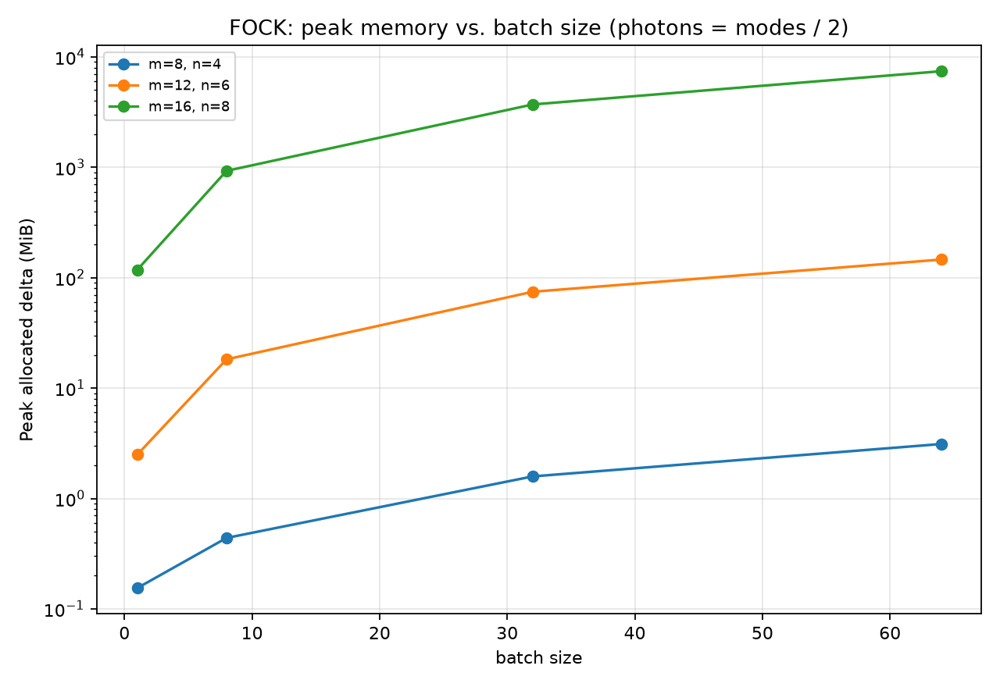
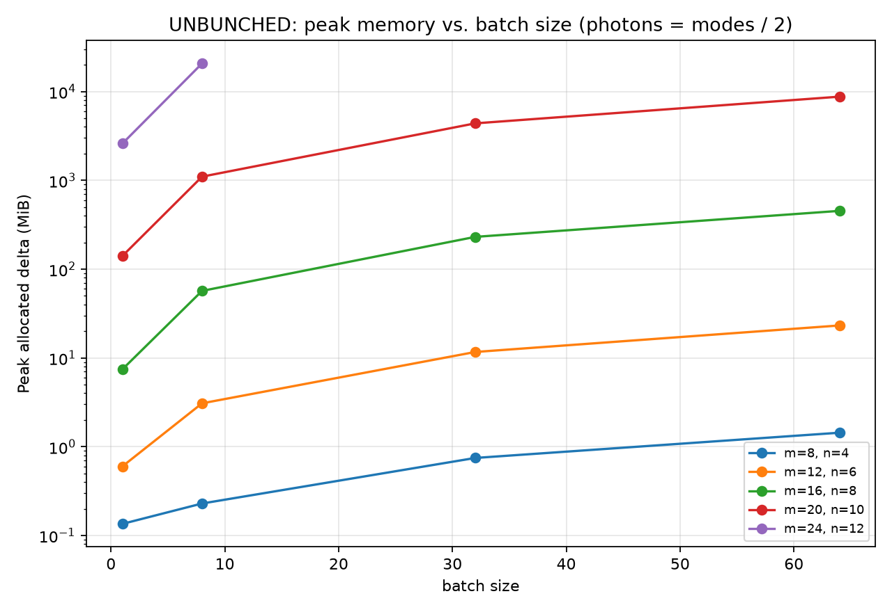
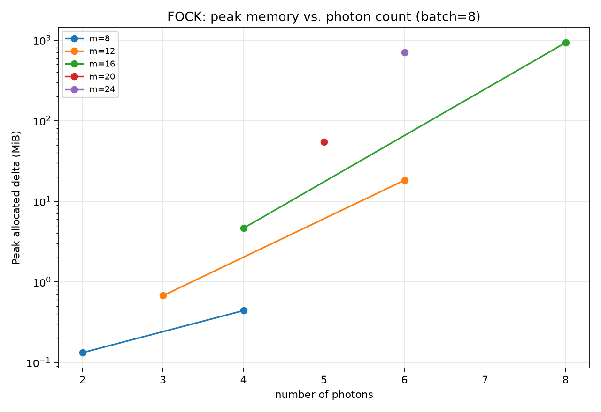
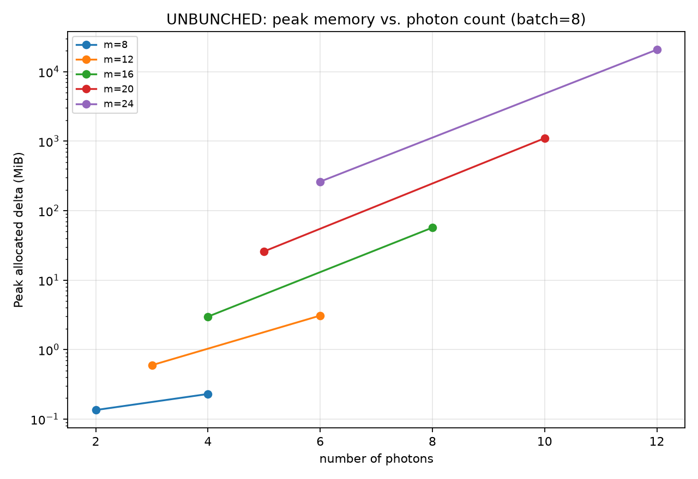
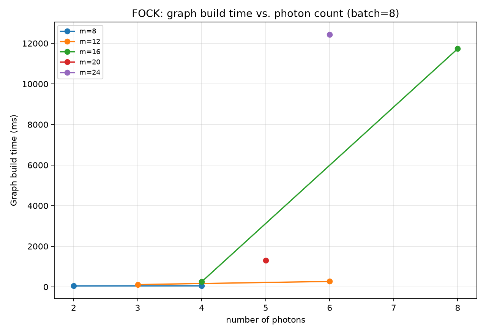
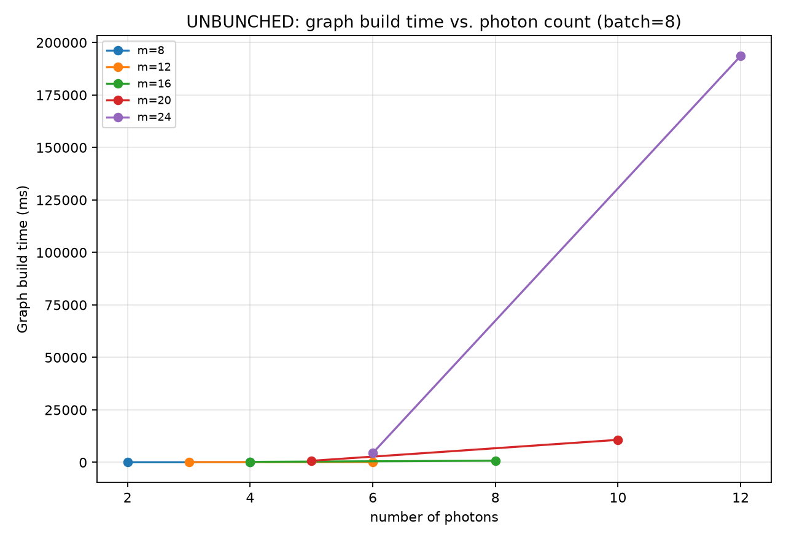
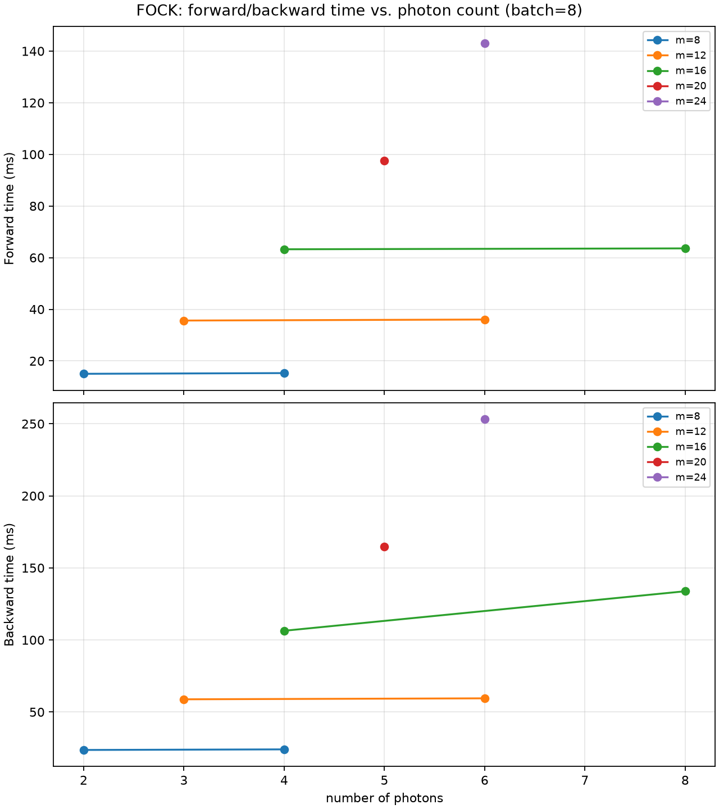
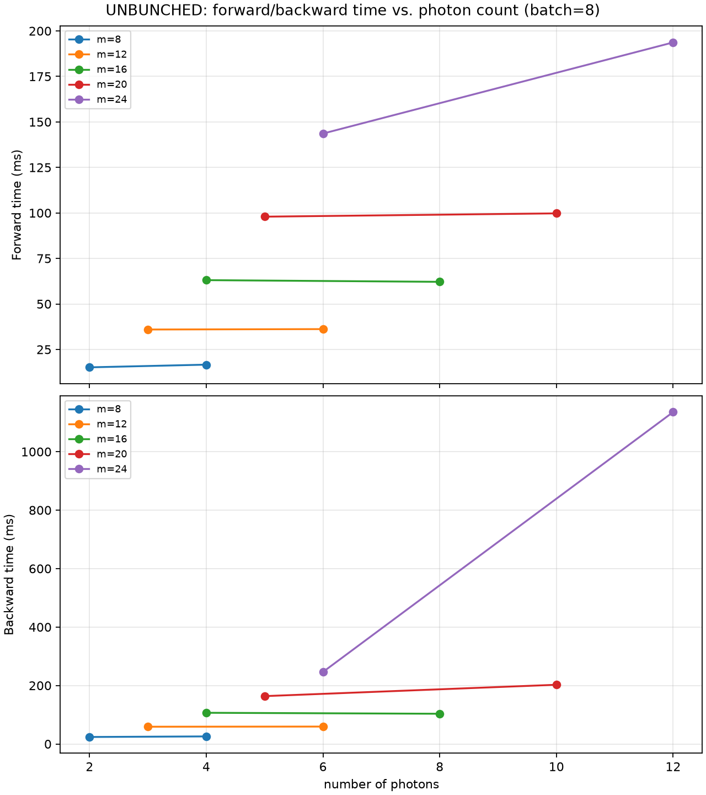
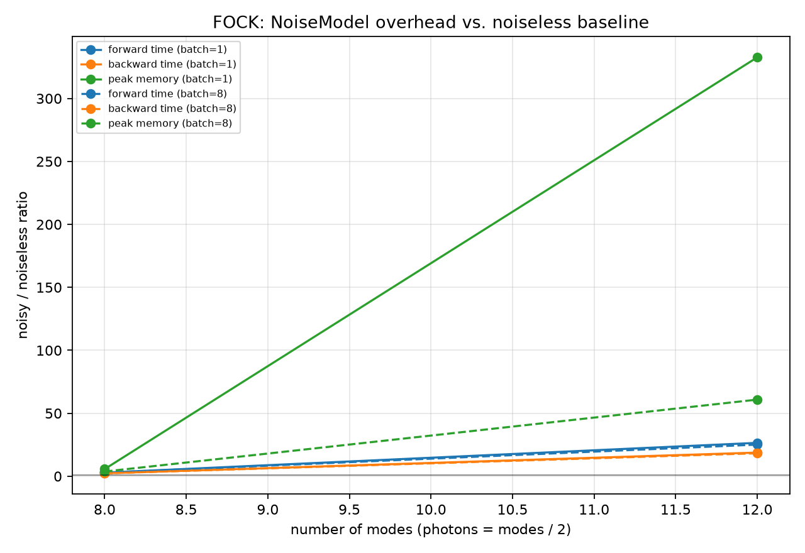
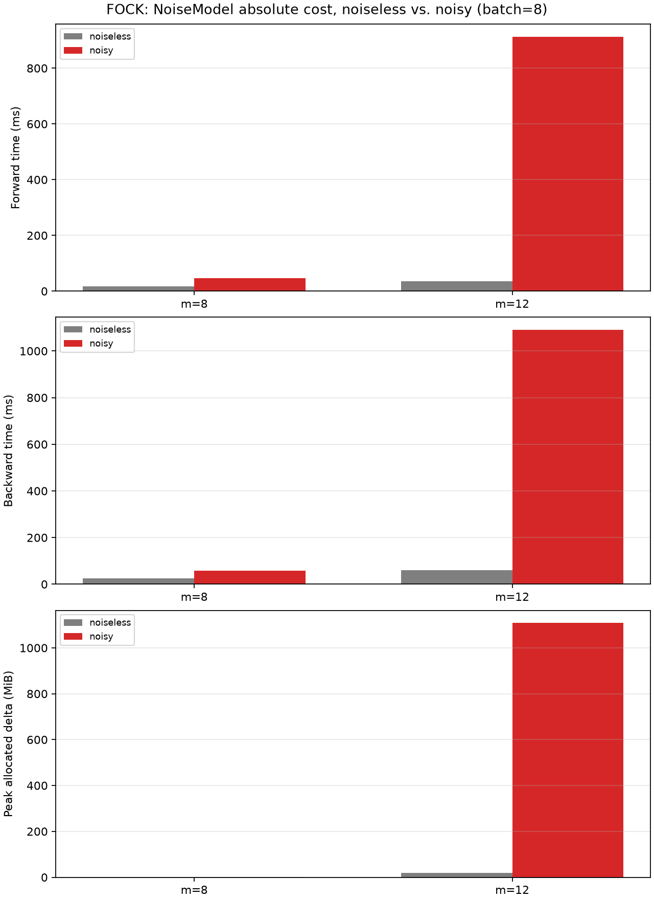

:github_url: https://github.com/merlinquantum/merlin

===========
Performance
===========

MerLin quantum layers can run as PyTorch modules on either CPU or GPU. The
following results measure ``QuantumLayer`` execution on an NVIDIA H100 PCIe
GPU with 80 GB of memory.

GPU benchmark
-------------

The benchmark constructs an MZI entangling circuit with angle encoding and two
trainable variational layers. It measures graph-building time, forward time,
backward time, and PyTorch CUDA allocated-memory deltas. Results use
``float32``, two warmup steps, and five measured repetitions. The main sweep
uses batch sizes 1, 8, 32, and 64, mode counts 8, 12, 16, 20, and 24, and both
``FOCK`` and ``UNBUNCHED`` computation spaces. Cases above 3,000,000 basis
states are skipped.

The benchmark was run with Python 3.12.3 and PyTorch 2.11.0+cu128. The plots
below were generated from
``benchmarks/gpu_benchmark/gpu_memory.json`` using
``benchmarks/gpu_benchmark/plot_gpu_memory_results.py``. Photon-count plots
use batch size 8. Memory is the larger forward/backward peak allocated delta.

At batch size 8, representative results are:

.. list-table::
   :header-rows: 1
   :widths: 22 16 16 16 16 16

   * - Space
     - Modes
     - Photons
     - Basis states
     - Forward
     - Backward
   * - ``FOCK``
     - 16
     - 8
     - 490,314
     - 63.6 ms
     - 133.8 ms
   * - ``FOCK``
     - 24
     - 6
     - 475,020
     - 143.1 ms
     - 253.1 ms
   * - ``UNBUNCHED``
     - 20
     - 10
     - 184,756
     - 99.8 ms
     - 202.5 ms
   * - ``UNBUNCHED``
     - 24
     - 12
     - 2,704,156
     - 193.7 ms
     - 1,135.5 ms

The largest measured memory delta is 20,739.1 MiB for 24 modes and 12 photons
in ``UNBUNCHED`` space at batch size 8. In ``FOCK`` space, 16 modes and 8
photons reaches 927.5 MiB at the same batch size; larger Fock-space cases were
outside the configured basis-size limit.

Memory scaling
~~~~~~~~~~~~~~

Timing scaling
~~~~~~~~~~~~~~

Graph-building time grows substantially with basis size. For example, at
batch size 8, building the 24-mode, 12-photon ``UNBUNCHED`` layer takes
193.6 seconds, while its forward and backward passes take 193.7 ms and
1,135.5 ms respectively.

NoiseModel overhead
~~~~~~~~~~~~~~~~~~~

A smaller FOCK sweep compares a noiseless layer with a ``NoiseModel`` using
source indistinguishability 0.9 and transmittance 0.95. At batch size 8, the
noise model increases the 12-mode, 6-photon case from 36.3 ms to 912.0 ms in
the forward pass and from 59.7 ms to 1,090.0 ms in the backward pass. The
corresponding peak allocated delta increases from 18.2 MiB to 1,108.1 MiB.

Reproducing the benchmark
--------------------------

From the repository root, run the benchmark and generate its plots with:

.. code-block:: bash

   PYTHONPATH=$PWD PCVL_PERSISTENT_PATH=.pcvl_home \
   python benchmarks/gpu_benchmark/benchmark_gpu_memory.py \
       --json-out benchmarks/gpu_benchmark/gpu_memory.json

   PYTHONPATH=$PWD python benchmarks/gpu_benchmark/plot_gpu_memory_results.py \
       --json benchmarks/gpu_benchmark/gpu_memory.json \
       --output-dir docs/source/_static/performance/h100-perf-2607 \
       --noise

The benchmark requires CUDA, PyTorch, and Perceval. See
``benchmarks/gpu_benchmark/benchmark_gpu_memory.py`` for the complete set of
options and the configured sweep limits.
