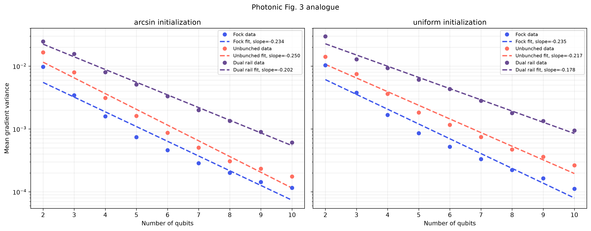

:github_url: https://github.com/merlinquantum/merlin

===============================================================================
Barren Plateaus in Quantum Neural Network Training Landscapes
===============================================================================

.. admonition:: Paper Information
   :class: note

   **Title**: Barren plateaus in quantum neural network training landscapes

   **Authors**: Jarrod R. McClean, Sergio Boixo, Vadim N. Smelyanskiy, Ryan Babbush, and Hartmut Neven

   **Published**: Nature Communications, 9, 4812 (2018)

   **DOI**: `10.1038/s41467-018-07090-4 <https://doi.org/10.1038/s41467-018-07090-4>`_

   **Reproduction Status**: ✅ Complete

   **Reproducer**: Eason Xie and Cassandre Notton

Project Repository
==================

.. merlin-gallery::
   :data: _data/galleries/reproduced_papers/BP_QNN_external_links.json
   :columns: 2
   :contour-color: #5648ED

Abstract
========

This paper introduces barren plateaus: regions of the optimization landscape of
random parameterized quantum circuits where gradient means and variances become
exponentially small as the number of qubits grows. The resulting concentration
of gradients can make variational quantum circuits difficult to train.

The paper studies the variance of gradients for random circuits as a function
of system size and circuit depth, and relates the depth dependence to the
convergence of random circuits toward a 2-design.

Significance
============

Barren plateaus provide a central explanation for why increasing the size of a
variational quantum model does not necessarily improve trainability. The work
also motivates architecture design and initialization strategies that preserve
useful gradients during optimization.

MerLin Implementation
=====================

The reproduction contains two implementations. The gate-based implementation
uses TorchQuantum to construct the paper's one-dimensional random circuit with
an initial ``RY(pi/4)`` layer, random single-qubit rotations, a nearest-neighbour
CZ ladder, and a local ``Z1 Z2`` objective. The MerLin implementation provides a
photonic Fig. 3 analogue using Fock, unbunched, and dual-rail computation spaces.

The photonic result is an analogue rather than a gate-for-gate reproduction:
the optical computation spaces and measured probability vectors are different
from the gate-based Hilbert space. The photonic setup follows the post-selection
comparison developed in `Pre-Asymptotic Trainability in Photonic Variational
Circuits under Postselection <https://arxiv.org/abs/2605.11879>`_.

Key Contributions Reproduced
============================

**Gradient concentration with system size**
  * Reproduced the Fig. 3-style measurement of gradient variance versus qubit count.
  * Fitted an exponential trend to the gate-based variance data.
  * Added a MerLin/photonic comparison across three computation spaces.

**Depth dependence**
  * Reproduced the Fig. 4-style variance sweep over circuit depth.
  * Compared systems ranging from 2 to 16 qubits.
  * Documented why nominal photonic layer counts are not directly comparable to gate-based depth after universal compilation.

**Reproducible experiments**
  * Added shared CLI/configuration support for smoke tests and paper-scale runs.
  * Included a notebook walkthrough and automated configuration tests.
  * Kept paper-scale settings configurable up to 26 qubits and 500 layers, subject to available resources.

Implementation Details
======================

The experiments are run from the root of the reproduced-papers repository:

.. code-block:: bash

   pip install -r papers/BP_QNN/requirements.txt
   python implementation.py --paper BP_QNN --config papers/BP_QNN/configs/fig3_gb.json
   python implementation.py --paper BP_QNN --config papers/BP_QNN/configs/fig3_merlin.json
   python implementation.py --paper BP_QNN --config papers/BP_QNN/configs/fig4_gb.json

For Fig. 3, the default gate-based configuration uses a depth of ten layers per
qubit. A fixed depth of ten for all system sizes is a shallow-circuit control,
not the paper-scale Fig. 3 protocol, because its local light cone does not grow
with system size.

Experimental Results
====================

The committed experiments use reduced qubit counts, circuit depths, and sample
counts so that they can run with practical local resources. The expected
gate-based result is an approximately exponential decrease in gradient variance
with qubit count, together with a depth-dependent convergence plateau.

The MerLin figure compares Fock, unbunched, and dual-rail spaces for arcsine and
uniform parameter initializations. Its slopes and absolute variances should be
compared qualitatively with the gate-based result, not treated as numerically
equivalent measurements.

Technical Implementation Details
================================

**Gate-based circuit**
  * Initial ``RY(pi/4)`` rotation on every wire.
  * Random ``RX``, ``RY``, and ``RZ`` rotations followed by a nearest-neighbour CZ ladder.
  * Local ``Z1 Z2`` objective and automatic differentiation of the first parameter.

**Photonic circuit**
  * MerLin/Perceval photonic model with Fock, unbunched, and dual-rail spaces.
  * Arcsine and uniform parameter initializations.
  * Post-selected probability-vector measurements for the Fig. 3 analogue.

**Outputs**
  * Timestamped run directories containing configuration snapshots and CSV results.
  * PNG/PDF plots when ``plot`` is enabled.
  * Exponential-fit parameters for Fig. 3 runs.

Performance Analysis
====================

**Observed scaling**
  * Gradient variance decreases approximately exponentially with qubit count in the gate-based reproduction.
  * The fitted slope and absolute variance depend on sampling, dtype, backend, and initialization.

**Current limitations**
  * Full paper-scale runs are expensive, particularly for large state-vector circuits.
  * The photonic computation spaces are not numerically equivalent to the gate-based Hilbert space.
  * Universal interferometer compilation removes a directly comparable photonic notion of circuit depth.

Interactive Exploration
=======================

The `BP_QNN notebook <https://github.com/merlinquantum/reproduced_papers/blob/main/papers/BP_QNN/bp_qnn.ipynb>`_
provides a laptop-sized Fig. 3 walkthrough for both the gate-based and photonic
backends. The repository also includes demo configurations for each backend.

Extensions and Future Work
==========================

* Compare non-universal optical networks at different depths up to the point at
  which they become universal.
* Extend the photonic study with larger systems and more samples where resources
  permit.
* Investigate initialization and architecture choices that avoid or delay barren
  plateau behaviour in photonic variational circuits.

Code Access and Documentation
=============================

**GitHub Repository**: `merlinquantum/reproduced_papers (BP_QNN) <https://github.com/merlinquantum/reproduced_papers/tree/main/papers/BP_QNN>`_

The repository includes the CLI runner, gate-based and photonic experiment
modules, configuration files, result assets, a notebook, and tests.

Citation
========

.. code-block:: bibtex

   @article{mcclean2018barren,
     title={Barren plateaus in quantum neural network training landscapes},
     author={McClean, Jarrod R. and Boixo, Sergio and Smelyanskiy, Vadim N. and Babbush, Ryan and Neven, Hartmut},
     journal={Nature Communications},
     volume={9},
     number={1},
     pages={4812},
     year={2018},
     publisher={Nature Publishing Group},
     doi={10.1038/s41467-018-07090-4}
   }

Impact and Applications
=======================

The barren plateau phenomenon is relevant to:

* **Variational circuit design**: choosing architectures with trainable local gradients.
* **Quantum model scaling**: understanding why larger circuits can become harder to optimize.
* **Initialization strategies**: selecting parameter distributions that preserve useful signal.
* **Photonic QML research**: comparing trainability across optical computation spaces.
