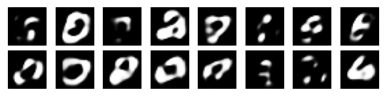

:github_url: https://github.com/merlinquantum/merlin

======================================================================
LatentQGAN: A Hybrid QGAN with Classical Convolutional Autoencoder
======================================================================

.. admonition:: Paper Information
   :class: note

   **Title**: LatentQGAN: A Hybrid QGAN with Classical Convolutional Autoencoder

   **Authors**: Alexis Vieloszynski, Soumaya Cherkaoui, Ola Ahmad, Jean-Frédéric Laprade, Olivier Nahman-Lévesque, Abdallah Aaraba, and Shengrui Wang

   **Published**: arXiv preprint (2024), arXiv:2409.14622

   **DOI**: `10.48550/arXiv.2409.14622 <https://doi.org/10.48550/arXiv.2409.14622>`_

   **Reproduction Status**: ✅ Complete

   **Reproducer**: Cassandre Notton, assisted by Claude

Project Repository
==================

.. merlin-gallery::
   :data: _data/galleries/reproduced_papers/LatentQGAN_external_links.json
   :columns: 2
   :contour-color: #5648ED

Abstract
========

LatentQGAN trains a classical convolutional autoencoder on MNIST and then
trains a hybrid quantum-classical GAN on the latent representation of each
digit class. The trained decoder maps generated latent samples back to 28x28
images, allowing the quantum generator to operate in a lower-dimensional space.

The paper uses five parametrized quantum circuits with four qubits and seven
layers per circuit. It reports Fréchet Distance comparisons with QPatchGAN and
MosaiQ while targeting a practical near-term quantum-computing workflow.

Significance
============

Latent-space generation reduces the output dimension that the quantum
generator must model. The classical network handles representation learning and
decoding, while the quantum model generates samples in the learned latent space.

The reproduction also tests the workflow with a MerLin photonic generator and a
matched classical baseline, making the comparison relevant to photonic QML.

MerLin Implementation
=====================

The reproduction reconstructs the autoencoder, latent generator, discriminator,
loss, optimizer, and Fréchet Distance evaluation. It includes four generator
variants:

* **Quantum**: Qiskit defines the authoritative four-qubit circuit; a PyTorch
  tensor implementation provides autograd during training.
* **MerLin**: each sub-generator is a six-mode, three-photon DUAL_RAIL photonic
  circuit.
* **Classical**: a small multilayer perceptron provides an approximately
  iso-parameter LatentGAN baseline.
* **RandomDecoder**: normalized random latent vectors are passed through the
  trained decoder as a sanity baseline.

The photonic generator is not parameter-isomorphic to the gate-based model:
the dense interferometer mesh uses approximately 600 parameters compared with
140 quantum-generator parameters.

Key Contributions Reproduced
============================

**Latent-space QGAN workflow**
  * Rebuilt the convolutional autoencoder and decoder pipeline for MNIST.
  * Trained class-specific quantum generators on latent representations.
  * Decoded generated samples back into 28x28 grayscale images.

**Comparative generator study**
  * Compared gate-based, MerLin photonic, classical, and RandomDecoder variants.
  * Used the same discriminator, optimizer, loss, and metric for trained variants.
  * Evaluated digits 0, 5, and 9 using Fréchet Distance.

**Photonic extension**
  * Implemented six-mode, three-photon dual-rail sub-generators in MerLin.
  * Matched the per-row output dimension of the gate-based generator.
  * Added a hardware-aware optical counterpart without claiming parameter parity.

Implementation Details
======================

Run experiments from the papers/LatentQGAN directory:

.. code-block:: bash

   pip install -r requirements.txt
   python implementation.py --config configs/mnist_reduced.json --seed 0 -- digit=0
   python implementation.py --config configs/mnist_merlin.json --seed 0 -- digit=0
   python implementation.py --config configs/mnist_classical.json --seed 0 -- digit=0

The reduced configuration uses 40 autoencoder epochs on a 20,000-image subset,
1,000 GAN iterations, batch size 8, and two seeds. The paper-accurate
configuration is available as mnist_original.json but is substantially slower
on a CPU.

Experimental Results
====================

The reduced-compute results report the best Fréchet Distance reached during
training, since the paper and reproduction observe quality degradation after
later GAN iterations.

.. list-table:: Best Fréchet Distance by model and MNIST class
   :header-rows: 1
   :widths: 34 16 16 16 18

   * - Model
     - Digit 0
     - Digit 5
     - Digit 9
     - Generator parameters
   * - LatentQGAN, gate-based
     - 42.3 ± 0.9
     - 36.9 ± 1.3
     - 36.6 ± 6.8
     - 140
   * - LatentQGAN, MerLin photonic
     - 30.5 ± 5.0
     - 36.7 ± 0.8
     - 30.1 ± 4.2
     - ~600
   * - LatentGAN, classical
     - 89.7 ± 17.6
     - 81.3 ± 4.1
     - 65.5 ± 0.9
     - ~162
   * - RandomDecoder
     - 115.1 ± 1.4
     - 78.4 ± 1.6
     - 73.5 ± 1.2
     - 0

Lower Fréchet Distance is better. The gate-based and MerLin generators
outperform the classical and random-decoder baselines in this reduced
experiment. The photonic result is the lowest of the tested variants, but it
uses more parameters and is not a parameter-efficiency comparison.

Technical Implementation Details
================================

**Autoencoder**
  * Convolutional encoder and decoder trained on MNIST.
  * The decoder reconstructs recognizable digit structure from latent vectors.
  * The reduced runs achieve approximately 0.018 reconstruction MSE.

**Gate-based generator**
  * Five four-qubit parametrized circuits with seven layers each.
  * RY input encoding, repeated RY and CZ layers, and ancilla post-selection.
  * Qiskit and PyTorch circuit implementations are tested for equivalence.

**MerLin generator**
  * Six optical modes and three photons in DUAL_RAIL computation space.
  * Input state [1, 0, 1, 0, 1, 0] with angle encoding.
  * Eight probabilities per row, matching the gate-based latent output dimension.

Performance Analysis
====================

**Observed outcomes**
  * All trained generator variants produce non-black, digit-like samples.
  * Gate-based and MerLin models beat the classical baseline in the reduced
    Fréchet Distance comparison.
  * The classical baseline tends to mode-collapse toward a similar sharp digit.

**Current limitations**
  * This is a simulation-only, partial reproduction; IBM Quantum hardware runs
    are not included.
  * The autoencoder and GAN budgets are reduced relative to the paper.
  * Only digits 0, 5, and 9 and two seeds are evaluated.
  * QPatchGAN and MosaiQ are not rerun; their paper values are retained only
    for context.
  * Training uses PyTorch autograd rather than the paper's parameter-shift
    gradient estimator.

Interactive Exploration
=======================

The repository is organized around the command-line entry point
implementation.py and includes configuration files, reusable library modules,
sweep utilities, result plots, and tests. Generated artifacts include
autoencoder reconstructions, Fréchet Distance curves, sample grids, and
per-run metric files.

Extensions and Future Work
==========================

* Run the full MNIST and paper-scale training configuration where compute permits.
* Add hardware-backed experiments and parameter-shift training.
* Reproduce the QPatchGAN and MosaiQ comparison models directly.
* Evaluate more digit classes, seeds, and higher-capacity classical baselines.
* Investigate parameter-efficient photonic architectures for the MerLin variant.

Code Access and Documentation
=============================

**GitHub Repository**: `merlinquantum/reproduced_papers (LatentQGAN) <https://github.com/merlinquantum/reproduced_papers/tree/main/papers/LatentQGAN>`_

The complete implementation includes the autoencoder, data and metric
utilities, quantum and photonic generators, training runner, configuration
files, sweep scripts, result assets, and tests.

Citation
========

.. code-block:: bibtex

   @misc{vieloszynski2024latentqgan,
     title={LatentQGAN: A Hybrid QGAN with Classical Convolutional Autoencoder},
     author={Vieloszynski, Alexis and Cherkaoui, Soumaya and Ahmad, Ola and
             Laprade, Jean-Frédéric and Nahman-Lévesque, Olivier and
             Aaraba, Abdallah and Wang, Shengrui},
     year={2024},
     eprint={2409.14622},
     archivePrefix={arXiv},
     primaryClass={quant-ph}
   }

Related Reproductions
=====================

LatentQGAN complements MerLin's Photonic Quantum GAN reproduction
(:doc:`photonic_QGAN`) by moving generation into a learned latent space and
comparing gate-based, photonic, and classical generators.

Impact and Applications
=======================

The latent-space QGAN approach is relevant to:

* **Hybrid QML**: assigning representation learning and generation to the
  classical and quantum components best suited to each task.
* **Photonic QGAN design**: reducing the dimension of the quantum generation
  problem before optical sampling.
* **NISQ experimentation**: keeping quantum circuits small while generating
  structured classical data.
* **Fair benchmarking**: separating generation quality from parameter count,
  hardware access, and gradient-estimation choices.
