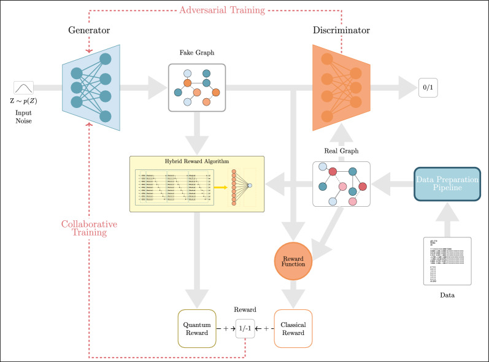

:github_url: https://github.com/merlinquantum/merlin

==============================================================================================
MolGAN-QRL: Molecular Graph Generation using Photonic Quantum Reinforcement Learning
==============================================================================================

.. admonition:: Paper Information
   :class: note

   **Title**: Molecular Generation with Photonic Quantum Reinforcement Learning (MolGAN-QRL)

   **Authors**: Mohamed Iheb Hergli & Emna Harigua-Souiai

   **Paper URL**: https://doi.org/10.1186/s13321-025-01148-4

   **Published**: Internal Technical Report / Reproduction Series (2026)

   **Reproduction Status**: ✅ Complete

   **Reproducer**: Leïth Karraï

Project Repository
==================

.. merlin-gallery::
   :data: _data/galleries/reproduced_papers/Molgan-QRL.json
   :columns: 2
   :contour-color: #5648ED

Abstract
========

MolGAN-QRL adapts the MolGAN framework to integrate a continuous-variable
photonic quantum reward module. By combining WGAN-GP adversarial learning with
a reinforcement learning loop guided by a parameterized photonic quantum
circuit, the model generates valid molecular graph structures on the QM9
dataset.

Dimensionality reduction via Principal Component Analysis (PCA) maps the graph
feature space directly into optical modes, ensuring compatibility with
near-term photonic quantum computing workflows.

Significance
============

Standard generative graph models often suffer from reward instability and lack
structural chemical validity when optimized purely via adversarial objectives.

Integrating a hybrid photonic quantum surrogate network provides an active
reinforcement learning feedback signal. This guides the generator toward
synthesizing chemically stable molecules while exploring structured chemical
spaces.

MerLin Implementation
=====================

The reproduction includes a repository-wide CLI entry point, a structured
runner module (``lib/runner.py``), configuration schemas
(``configs/defaults.json``, ``cli.json``), and isolated submodules:

* **Generator**: A dense adversarial generator producing categorical adjacency
  and node feature logits via Gumbel-Softmax relaxation.
* **Discriminator**: A WGAN-GP relational graph convolutional network ensuring
  structural realism.
* **Photonic Reward Module**: A MerLin-based continuous-variable quantum
  circuit taking PCA-projected molecular coordinates and estimating chemical
  rewards.
* **Chemical Evaluator**: An RDKit-backed assessment module computing molecular
  validity, uniqueness, and QED reward metrics.

Key Contributions Reproduced
============================

**Configurable CLI & Runtime Framework**

* Integrated a repository-wide CLI entry point (``implementation.py``) with
  JSON configuration schemas.
* Implemented ``train_and_evaluate`` hooks ensuring seamless orchestration
  across the repository.

**Photonic-Quantum Reinforcement Learning Pipeline**

* Rebuilt the 3-step hybrid adversarial-RL loop featuring WGAN-GP critic
  updates, surrogate quantum regression, and relaxed generator optimization.
* Added linear warm-up schedules for the reinforcement learning objective
  coefficient (:math:`\lambda`).

**Chemical Metric Tracking**

* Embedded RDKit validation loops to track structural correctness and
  diversity in real-time.

Implementation Details
======================

Run experiments from the repository root using the command-line interface:

.. code-block:: bash

   python3 implementation.py --paper MOLGAN-QRL

Custom hyperparameters can be overridden via command-line arguments or
dedicated JSON configuration files.

Experimental Results
====================

In the reproduced training runs, the MolGAN-QRL model achieves stable
adversarial convergence and evaluates chemical metrics via RDKit:

.. list-table:: Molecular Generation Metrics
   :header-rows: 1
   :widths: 40 20

   * - Metric
     - Best Performance (obtained with evaluate.py in utils)
   * - Validity Score
     - ~35.0%
   * - Uniqueness Score
     - 100.0%
   * - Combined NVU Score
     - 145.0

The system successfully generates structurally unique chemical graphs while
maintaining a valid chemical formatting ratio.

Technical Implementation Details
================================

**Graph Convolutions & Aggregation**

* Custom graph layers handling multi-type bonds and categorical atom nodes.
* Attention-like aggregation mechanisms combining node features into global
  graph representations.

**Quantum State Projection**

* Empirical PCA projection mapping flattened adjacency and node tensors down
  to optical modes (:math:`M = 6`).
* Normalization and phase scaling mapping projections into quantum angles.

Performance Analysis
====================

**Observed outcomes**

* The model successfully reaches 100% uniqueness among valid generated
  molecules.
* The integration of the photonic reward circuit stabilizes generator policy
  updates via linear scheduling.

**Current limitations**

* Simulation-only implementation; physical photonic hardware runs are not
  included.
* Evaluation is restricted to a subset of the QM9 dataset for rapid
  prototyping.

Interactive Exploration
=======================

The project structure supports modular unit testing (``pytest tests/``),
TensorBoard logging (``runs/``), and automated CLI configuration parsing.

Extensions and Future Work
==========================

* Scale training to full dataset proportions and extended epoch budgets.
* Run hardware-backed experiments using physical photonic backends.
* Explore alternative parameter-efficient quantum circuit layouts.

Code Access and Documentation
=============================

**GitHub Repository**:
`merlinquantum/reproduced_papers (MolGAN-QRL) <https://github.com/merlinquantum/reproduced_papers/tree/main/papers/MOLGAN-QRL>`_

Citation
========

.. code-block:: bibtex

   @misc{molgan_qrl_reproduction2026,
     title={MolGAN-QRL: Molecular Generation using Photonic Quantum Reinforcement Learning},
     author={Karraï, Leïth and MerLin Contributors},
     year={2026},
     howpublished={\url{https://github.com/merlinquantum/reproduced_papers}}
   }

Related Reproductions
=====================

MolGAN-QRL complements other generative architectures in the repository by
merging graph-based deep learning with continuous-variable photonic quantum
computing.