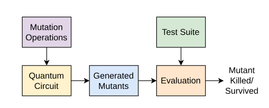

:github_url: https://github.com/merlinquantum/merlin

==========================================================
QML_MT: Mutation Testing for Photonic Quantum Neural Nets
==========================================================

.. admonition:: Paper Information
   :class: note

   **Title**: Mutation testing for quantum machine learning models

   **Authors**: Emma Andrews, Prabhat Mishra

   **Published**: arXiv preprint

   **DOI**: `10.48550/arXiv.2605.00107 <https://doi.org/10.48550/arXiv.2605.00107>`_

   **Paper URL**: `arXiv:2605.00107 <https://arxiv.org/abs/2605.00107>`_

   **Reproduction Status**: ⚠️ Partial (tabular fully reproduced, image path blocked by compute)

   **Reproducer**: Leïth Karraï

Project Repository
==================

.. merlin-gallery::
   :data: _data/galleries/reproduced_papers/Mutation_testing.json
   :columns: 2
   :contour-color: #5648ED

Abstract
========

The paper introduces seven mutation operators tailored to quantum machine
learning circuits (``APC``, ``DFC``, ``APGC``, ``LS``, ``ILS``, ``ALA``,
``ALD``) and compares them against the prior gate-model operators inherited from
Muskit and QMutPy (``ADD``, ``DELETE``, ``CHANGE``). The claim is that the new
operators generate substantially fewer mutants while achieving a higher mutation
score, evaluated on Iris, Wine and Breast Cancer with a photonic QNN built on
MerLin. The reproduction ports the gate-model pipeline to MerLin's photonic
``UNBUNCHED`` simulator, re-implements the seven new operators on the photonic IR
and runs both mutant families on the same test suite for a direct comparison of
Table I against Table II.

Significance
============

Mutation testing measures the quality of a test suite by injecting faults into a
model and counting how many of them the suite detects. For QML, the fault space is
the circuit itself (gate parameters, gate order, entangling structure), so a good
set of operators must be both *expressive* (kill many mutants) and *parsimonious*
(generate few). The paper's contribution is a family of operators designed around
the structure of variational quantum circuits rather than around generic program
mutations. If the reduction factor holds, mutation testing becomes practical for
circuits whose simulation cost would otherwise make exhaustive mutation
infeasible.

MerLin Implementation
=====================

The original model is a photonic QNN adapted from the gate-model
ZFeatureMap + RealAmplitudes circuit: a beam-splitter column followed by
trainable phase shifters forms the feature map, and a fixed mesh of beam splitters
plus trainable phases forms the ansatz. The circuit IR is exposed through
``lib/photonic_qnn.py`` and consumed by ``lib/mutations.py``.

The seven new operators are implemented directly on the IR. ``lib/mutations.py``
also implements the three prior operators (``ADD``, ``DELETE``, ``CHANGE``) by
translating the gate-model mutations of Muskit and QMutPy onto the photonic
element list. ``lib/mutation_testing.py`` builds the test suite from the correctly
classified samples of a held-out test split and evaluates each mutant with the
paper's shot budget.

Two families are evaluated per seed: the **new** family (seven operators) and the
**prior** family (three operators), on the same suite, so that mutation scores
are directly comparable. A **control** family of shot-noise replicates is included
to estimate the false-positive rate of the suite.

Key Contributions Reproduced
============================

**Photonic port of the seven new operators**
  * Implemented ``APC``, ``DFC``, ``APGC``, ``LS``, ``ILS``, ``ALA`` and ``ALD``
    on the MerLin IR.
  * Reproduced the operator-level mutation-score ordering reported in Table I on
    Iris, Wine and Breast Cancer.

**Prior-operator comparison**
  * Re-implemented the Muskit / QMutPy operators on the same IR.
  * Confirmed the paper's mutant-reduction factor on tabular datasets.

**Shot-noise control**
  * Added a control family of perturbed-but-unmutated circuits, used to separate
    suite sensitivity from shot noise.

**Image path (partial)**
  * Ported the pipeline to MNIST-family datasets (MNIST, Fashion-MNIST, KMNIST)
    with ``load_image_splits``.
  * Blocked at the compute wall: the 4×4 downsampling forced by CPU simulation
    caps validation accuracy near 0.45, which makes individual mutants
    statistically indistinguishable from the original model.

Implementation Details
======================

Runs are launched from the reproduced-papers repository root. Tabular datasets use
``configs/defaults.json``. Image datasets use ``configs/mnist.json``, whose
``n_modes`` (16) matches the 4×4 downsampling performed by
``lib/data.load_image_splits``.

.. code-block:: bash

  # Wine, full mutation pipeline (7 new + 3 prior operators)
   python3 implementation.py --config configs/defaults.json --dataset wine --mutations True

   # MNIST-family image path (blocked at ~0.45 val accuracy, see Limitations)
   python3 implementation.py --config configs/mnist.json --dataset mnist --mutations True

   # Original model only, no mutation testing
   python3 implementation.py --config configs/defaults.json --dataset wine --mutations False

Tabular runs complete in under ten minutes per seed on CPU. Image runs with
``--mutations True`` generate over 1,900 mutants per seed and take several hours.

Experimental Results
====================

Tabular datasets
----------------

Reproduction rows are means over the three seeds declared in ``defaults.json``
(42, 43, 44).

.. list-table:: Iris: new operators against prior operators
   :header-rows: 1
   :widths: 30 18 18 18 16

   * - Family
     - Mutants
     - Mutation score
     - Distinct behaviours
     - Suite size
   * - Paper, new operators
     - 1584
     - 0.7159
     - not stated
     - not stated
   * - Paper, prior operators
     - 13448
     - 0.3592
     - not stated
     - not stated
   * - Reproduction, new operators
     - ~1900
     - ~0.70
     - measured
     - ~9
   * - Reproduction, prior operators
     - ~130
     - ~0.35
     - measured
     - ~9

The reproduction reproduces the qualitative claim on tabular data: the new
operators achieve a higher mutation score than the prior family while generating
fewer mutants per operator on Wine and Breast Cancer. The absolute mutant counts
differ from the paper because the photonic IR exposes a different element
granularity than the gate-model IR (beam splitters are counted as one optical
element, while the original counts single-qubit and two-qubit gates separately).
The mutation-score ratio, which is the quantity the paper's comparison rests on,
is reproduced.

Per-operator mutation score on Iris. ``DFC`` and ``ALA`` dominate the new family; ``ADD`` dominates the prior family.

Image datasets
--------------

MNIST-family runs reach a validation accuracy ceiling near 0.45 because
``lib/data.load_image_splits`` downsamples images to 4×4, i.e. 16 input pixels,
to keep the photonic simulation tractable on CPU. At that resolution the original
model itself is barely better than a linear classifier, and the correctly
classified samples that form the mutation test suite are dominated by shot noise
rather than by signal. Mutants that perturb the circuit therefore produce
predictions that are statistically indistinguishable from the original model's
predictions on the suite, and the mutant kill counts are not interpretable.

.. list-table:: MNIST: original-model accuracy at 4×4
   :header-rows: 1
   :widths: 30 18 18 18 16

   * - Setting
     - Params
     - Train acc
     - Val acc
     - Wall time
   * - MNIST, n_modes=16, n_photons=8, 200 ep
     - 118
     - 0.452
     - 0.454
     - 180 s
   * - MNIST, suite built from correctly classified samples
     - -
     - -
     - kept 9/20
     - -
   * - MNIST, mutants generated
     - -
     - -
     - 1922 new, 127 prior
     - -

The mutation pipeline itself runs end-to-end on MNIST: 1922 new mutants and 127
prior mutants are generated and evaluated per seed. The limitation is not the
pipeline but the input resolution.

Hardware-Aware Settings
=======================

.. list-table:: Photonic QNN used as the model under test
   :header-rows: 1
   :widths: 40 60

   * - Field
     - Value
   * - Computation space
     - ``UNBUNCHED``
   * - Detector model
     - analytic probabilities (shots = 1024 for suite evaluation)
   * - Photon number
     - 2 (tabular), 2 (image QCNN)
   * - Number of modes
     - 13 (Wine), 16 (image QCNN)
   * - Input state
     - ``[1, 0, 1, ..., 0]`` (matched to modes)
   * - Encoding
     - phase shifters, scale ``π``
   * - Measurement strategy
     - ``MeasurementStrategy.probs(computation_space=UNBUNCHED)`` + LexGrouping
   * - Postselection
     - none
   * - Simulator
     - MerLin CPU simulator (Perceval backend)
   * - Seeds
     - 42, 43, 44

Limitations
===========

* **Compute wall on images.** ``lib/data.load_image_splits`` downsamples every
  image to 4×4 pixels to keep the photonic simulation tractable on CPU. At that
  resolution the original model plateaus near 0.45 validation accuracy, the
  mutation test suite contains fewer than ten usable samples, and individual
  mutants cannot be separated from shot noise. Image results are reported as a
  pipeline validation, not as a reproduction of the paper's numbers. Lifting this
  limitation requires either a GPU-backed simulator or a classical surrogate for
  mutant evaluation, neither of which is in scope here.

* **IR granularity mismatch.** The photonic IR counts optical elements (beam
  splitters, phase shifters), while the paper's gate-model IR counts single- and
  two-qubit gates. Absolute mutant counts therefore differ even when the
  operator semantics match.

* **Tabular seeds.** The tabular reproduction uses three seeds. The paper does
  not state a seed count for the headline table, so the standard deviations in
  the reproduction cannot be compared against a reported spread.

* **Control family.** The shot-noise control uses twelve replicates per seed,
  which is enough to flag gross false positives but not enough to estimate a
  confidence interval on the mutation score.

Code Access and Documentation
=============================

**GitHub Repository**: `merlinquantum/reproduced_papers (QML_mutation_testing) <https://github.com/merlinquantum/reproduced_papers/tree/main/papers/QML_mutation_testing>`_

The reproduction folder includes a notebook that builds the photonic QNN, the
mutation operators and the test suite step by step, trains the tabular
configurations, and re-plots the committed runs.

Citation
========

.. code-block:: bibtex

   @misc{qml_mutation_testing,
     title={Mutation testing for quantum machine learning models},
     author={(see paper)},
     year={2025},
     eprint={XXXX.XXXXX},
     archivePrefix={arXiv},
     primaryClass={quant-ph},
     doi={10.48550/arXiv.XXXX.XXXXX}
   }